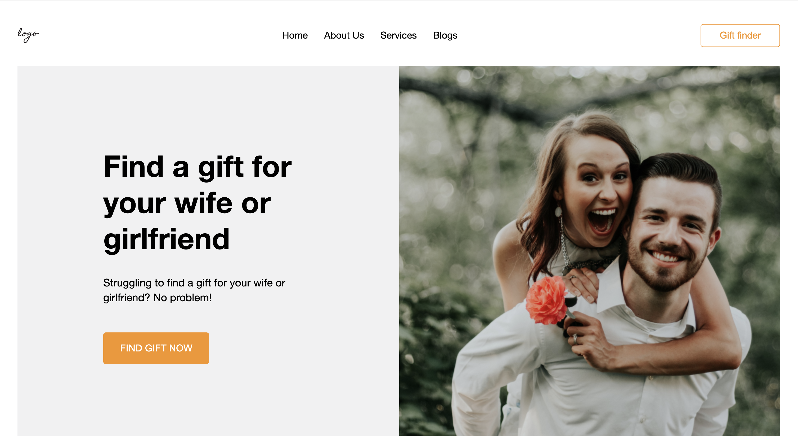

# Gifts

### Описание
Проект посвящен верстке лендинга при помощи CSS и HTML. Создавался с целью закрепления навыков. Без адаптива.

### **Какие технологии использовались**
* HTML;
*  CSS:
    - Псевдоклассы, стилизация кнопок и ссылок;
    - Flex layout;
    - Позиционирование элементов;
* Верстка Pixel Perfect;

### **Макет проекта в Figma**
[Макет](https://www.figma.com/file/f0oL1JWguWWlrnpP0YNI3c/Freebie---Gift-Store-Website-Template?type=design&node-id=0-1&mode=design&t=PymWfkGD3RoKkEje-0)

### **Ссылка на сайт**
https://ksenia-beznos.github.io/Gifts/

**Автор сайта**: Ксения Безнос.
